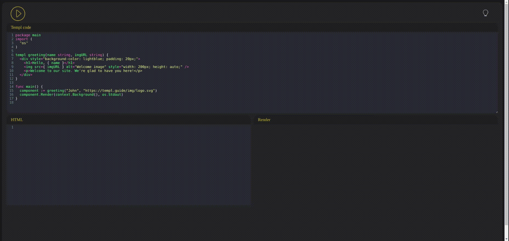

[](https://xcfile.dev)

# Templ Playground

This project is a templ playground, using WebAssembly (WASM) application to convert Templ templates into Go code and execute them in the go playground, Rendering the result to the user.



## How to Use

1. Run the `xc build-wasm` command (If not installed see XC documentation [here](https://xcfile.dev/)).
2. Run the `xc serve` command (If not installed see XC documentation [here](https://xcfile.dev/)).
3. Navigate to `localhost:8080`
4. Write your Templ code in the editor.
5. Click the "Run" button to convert the Templ code into Go code.
6. The HTML code will be displayed in the bottom left editor.
7. The rendered result on the bottom left preview panel.

## Dependencies
Templ: A library for generating Go code from Templ templates.
CodeMirror: A versatile text editor implemented in JavaScript for the browser.

## Tasks
### build-wasm
Builds templ to go converter wasm module
```sh
GOOS=js GOARCH=wasm go build -o public/main.wasm ./templtogo
```
### install
Install dev dependencies.
```sh
go install github.com/a-h/serve@main
```
### serve
Runs a simple web server for local playground development
```sh
serve -dir ./public
```
